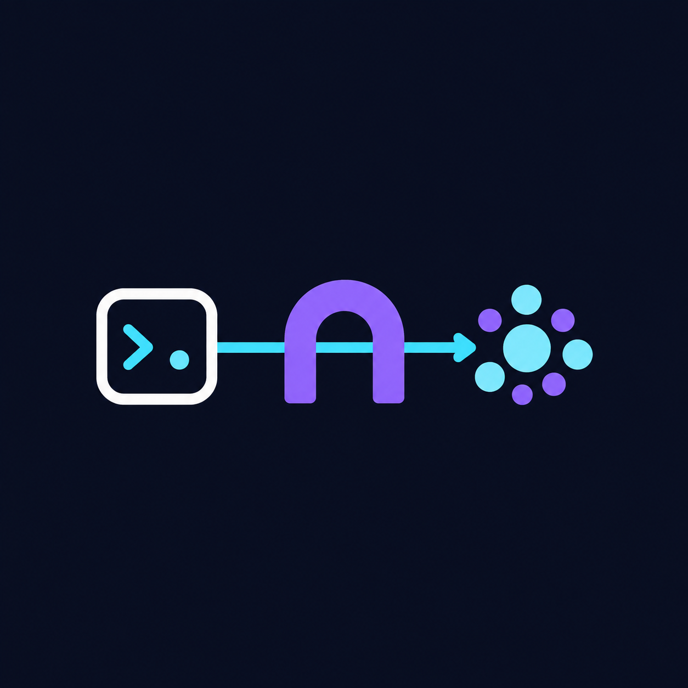

<div align="center">
  <a href="https://github.com/fmguerreiro/omp-headroom">
    
  </a>
  <h1>omp-headroom</h1>
  <p><em>Route Oh My Pi model requests through a local Headroom proxy.</em></p>
  <a href="LICENSE"></a>
</div>

## Install

Install the `headroom` CLI on `PATH`, then install the plugin:

```sh
pip install "headroom-ai[proxy]"
omp install github:fmguerreiro/omp-headroom
```

For local development, use `omp plugin link /path/to/omp-headroom` instead. Remove any previous `~/.omp/agent/extensions/headroom.ts` copy to avoid loading both. Start a new OMP session after installation; `/reload` does not reload extension modules.

## Configuration

| Setting | Behavior |
| --- | --- |
| `OMP_HEADROOM_URL` | Proxy URL; default `http://127.0.0.1:8787`. |
| `OMP_HEADROOM_PORT` | Default proxy port when `OMP_HEADROOM_URL` is unset; default `8787`. |
| `OMP_HEADROOM_PROVIDER_URLS` | Optional JSON object mapping existing OMP provider names to their Headroom base URLs. Unset by default, so plugin does not change provider routing. |
| `SSL_CERT_FILE` | Optional CA bundle passed through to Headroom unchanged. |

Set `OMP_HEADROOM_PROVIDER_URLS` only for providers you want routed through Headroom. OMP keeps every other provider's user configuration.

```sh
export OMP_HEADROOM_PROVIDER_URLS='{
  "anthropic": "http://127.0.0.1:8787",
  "openai": "http://127.0.0.1:8787/v1"
}'
```

The launcher binds only to `127.0.0.1` and writes startup output to `~/.headroom/logs/launcher.log`. A proxy already responding at the configured URL is reused; startup settings only apply when this extension launches a new proxy.

## Check

```sh
curl -fsS http://127.0.0.1:8787/health
```

The proxy's log records `event=ssl_ca_bundle_loaded` when it finds the configured CA bundle. API requests still require their normal provider credentials.

## License

MIT. See [LICENSE](LICENSE).
